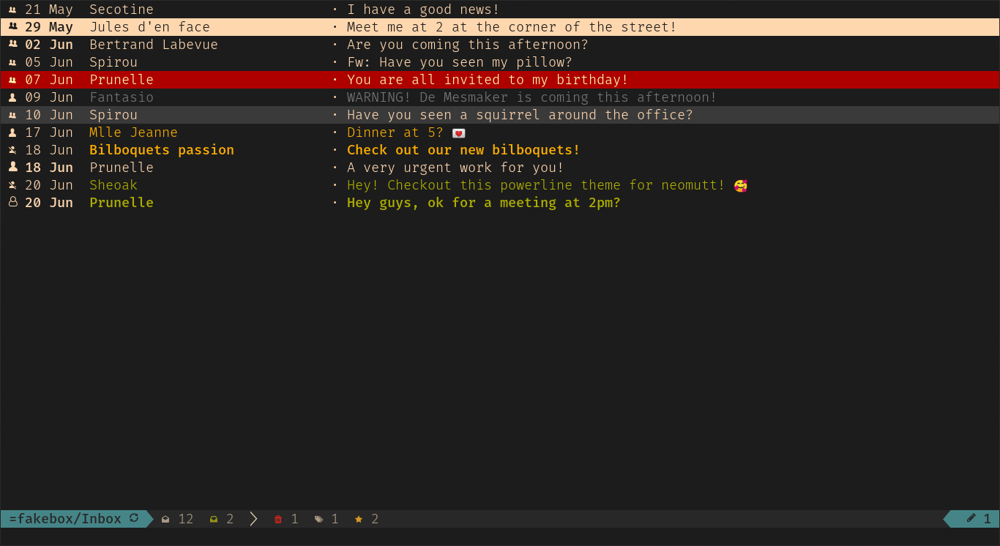
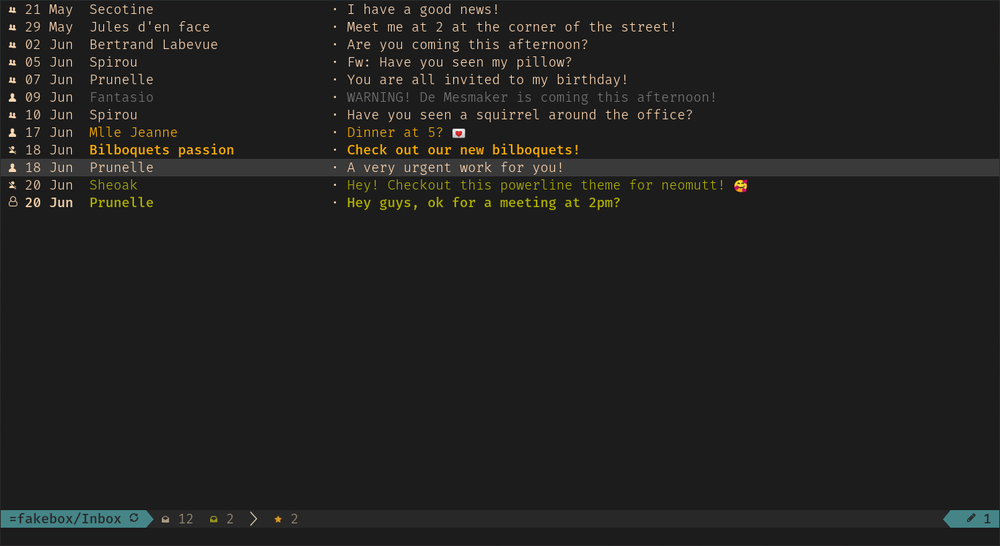
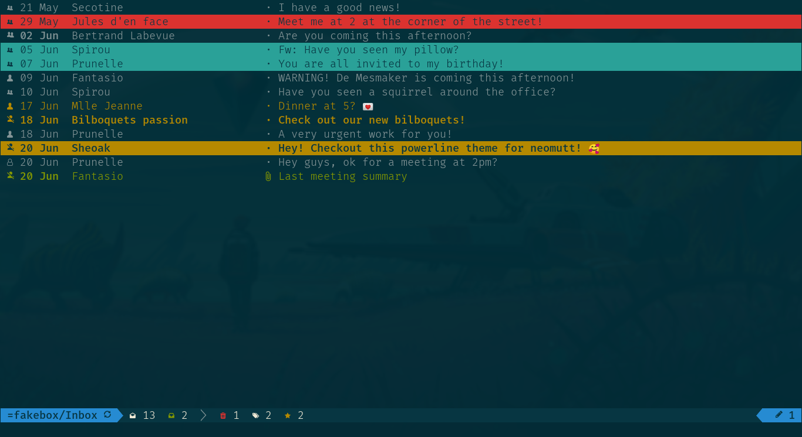
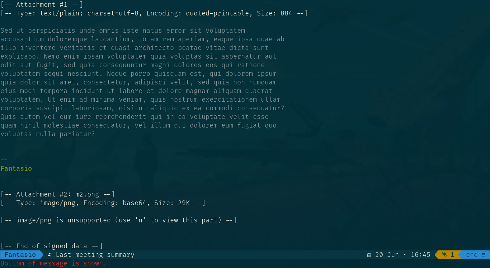

# Neomutt powerline-nerdfonts

Allows you to transform [neomutt][1] theme with [powerline][2] and [nerd fonts][3].
The code is little bit of a hack due to mutt/neomutt limitations but it works.
It should work with most themes but there is some tuning added for *solarized* and
*gruvbox*.

**Notes:**

* Not compatible with mutt, it uses neomutt new features.
* Work in progress.


## Screenshots

### Gruvbox

[Gruvbox][4] adaptation.





### Solarized

[Solarized][5] adaptation.





## Requirements

- [Nerd fonts][3]
- Terminal with nerd font configured ([kitty][6] works)


## Installation

You just need to source this repository files:


  ```
  git clone https://github.com/sheoak/neomutt-powerline-nerdfonts.git
  ~/.config/neomutt/powerline
  # edit neomutt configuration:
  vi ~/.config/neomutt/neomuttrc

  # for solarized:
  # you must load solarized 16 colors theme BEFORE this
  # you terminal 16 colors must be set to solarized theme
  source powerline/powerline.neomuttrc

  # for gruvbox:
  # you must load gruvbox theme BEFORE this
  # you terminal 16 colors must be set to gruvbox theme
  source powerline/colors/gruvbox-powerline.neomuttrc
  source powerline/powerline.neomuttrc
  ```


Remove or comment call to:

- index_format
- pager_format
- status_format
- vfolder_format
- attach_format
- to_chars
- status_chars
- tag-transforms
- tag-formats


Or source the files at the end of your configuration to avoid conflict.


## Features:

* Minimalist theme to remove cluttering from neomutt interface
* Powerline font status bar index and pager
* Nerd font icons in message list, status bar, attachements
* Gruvbox and solarized patching to improve listing

### Status bar includes the following indicators with nerd font icons:

* Total messages
* New messages
* Flagged messages
* Marked messages
* Mark for deletion messages
* Postponed messages
* Unsynced mailbox
* Attachements (pager)

### Index includes the following icons indicators:

* Addressed to me : yes/no/cc/from me
* Attachement present


## Status

* [x] Index status
* [x] Pager status
* [x] Index list
* [ ] Browser
* [ ] Browser list
* [ ] Solarized patch
* [ ] Virtual mailboxes icons

[1]: https://github.com/neomutt
[2]: https://github.com/powerline/powerline
[3]: http://nerdfonts.com/
[4]: https://github.com/morhetz/gruvbox
[5]: https://ethanschoonover.com/solarized/
[6]: https://github.com/kovidgoyal/kitty
